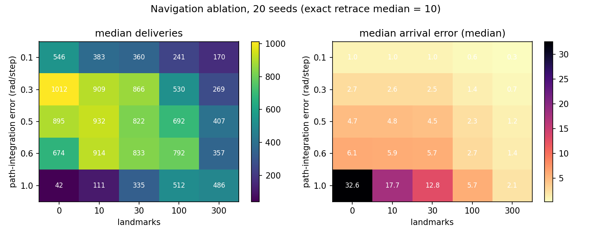
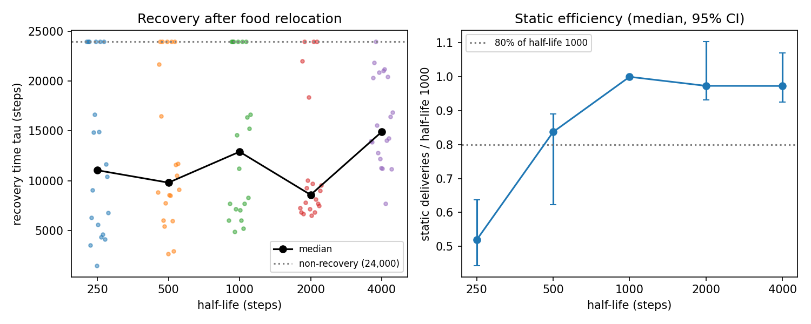

# H1a on the path-integration baseline

Written 2026-09-30. Plan: `docs/H1A_ANALYSIS_PLAN.md` (committed before any run; post-result
decisions listed at its end). Brief: `docs/TASK_BRIEF_H1A_BASELINE.md`.
Code: `scripts/h1a_run.py` (runs), `scripts/h1a_summarise.py` (rules, statistics, figures).
Step 4 is the main result; Steps 2, 3 and 5 are exploratory.

## Verdict

> **H1a is not supported** under the strict criterion (set by the user **after** seeing the Step 4
> results): no intermediate half-life recovered faster than *both* extremes with 95% CIs excluding 0.
> The only clear difference was half-life 2000 recovering faster than 4000 (Δ = −6,332 steps,
> CI [−10,840, −4,268]); against the fast-decay extreme (250) no intermediate differed clearly.
> At the neighbouring diffusion setting (Step 5) the verdict is the same, but the 2000-vs-4000
> difference shrank to −481 steps (CI [−2,432, 4,509]), so even that partial result is not robust.

What *is* consistent across both diffusion settings: very fast decay (half-life 250) costs static
efficiency badly (ratio 0.52 and 0.21 of half-life 1000), and the per-seed spread of recovery times
is large (several seeds at every half-life never recover within 24,000 steps).

## Model (baseline)

Validated scalar model (100 ants, 300 × 300 arena, cell 1, nest (150,150), food A (240,150),
food B (150,240), step 0.6), with these changes:

- **Homing**: path integration (Gaussian compass noise 0.5 rad per step) + landmark correction
  (100 random landmarks, view radius 8). Nest perceived within 3 units; if an ant believes it is home
  but cannot see the nest it runs a spiral search (loop spacing 4). All of these are modelling
  assumptions, not calibrated values; compass noise 0.5 is a user decision, not tuned on results.
  This is "egocentric vs egocentric + landmark correction"; there is no landmark-only mode.
- **No pheromone deposit during spiral search** (new option; "on" reproduces the old code, tested).
- **Trail physics** (Step 2): diffusion D = 0.01 per step and detection thresholds on 0.25 / off 0.125.
  The thresholds were **halved** from the validated model's on 0.5 / off 0.25. This was not a free
  choice: the Step 2 selection rule (written before running) tried the original pair first, no D
  passed all rules with it, so the rule moved to the halved pair and selected D = 0.01 there.
- Decay: exponential, reference half-life 1000 steps (not tuned).

## Step 1 — what compass noise 0.5 means

Arrival error = distance between the ant's estimated and true position when it reaches the nest
area. Outbound path length at pickup: median ~108 units (the straight nest–food distance is 90).

| Condition | Median arrival error | 90th percentile | Median error by outbound-length tertile (short / mid / long) |
|---|---|---|---|
| Error 0.5, 100 landmarks (Step 3) | 2.5 | 7.8 | 2.8 / 2.3 / 2.3 |
| Error 0.5, no landmarks (Step 3) | 4.7 | 11.3 | 4.1 / 4.3 / 6.3 |
| Baseline in Step 4, half-life 1000 | 2.3 | 7.1 | 2.7 / 2.3 / 2.0 |

In plain terms: after a ~100-unit trip, the baseline ant's home estimate is typically off by about
2.5 units (2–3% of the trip), so most ants arrive within sight of the nest (radius 3); about one in
ten is off by 7+ units and must search. Without landmarks the error doubles and grows with trip length.

## Step 2 — trail-physics calibration (10 seeds, exploratory)

Rules written before running: (1) trail following exists (median follower share ≥ 0.02 in the
baseline); (2) no thin-trail artefact (adding compass error 0 → 0.1 raises deliveries by ≤ 25%);
(3) numerically stable. Smallest D passing all, default thresholds first.

| D | Thresholds | Deliveries err 0 / err 0.1 / baseline | Ratio err 0.1 : err 0 | Follower share (baseline) | Pass |
|---|---|---|---|---|---|
| 0 | 0.5/0.25 | 46 / 204 / 186 | 5.63 | 0.044 | no (artefact) |
| 0 | 0.25/0.125 | 53 / 216 / 306 | 3.80 | 0.062 | no (artefact) |
| 0.01 | 0.5/0.25 | 90 / 167 / 361 | 2.19 | 0.081 | no (artefact) |
| **0.01** | **0.25/0.125** | **508 / 433 / 911** | **0.85** | **0.167** | **yes** |
| 0.02 | 0.5/0.25 | 40 / 52 / 20 | 1.50 | 0.005 | no (no recruitment) |
| 0.02 | 0.25/0.125 | 152 / 392 / 578 | 2.28 | 0.154 | no (artefact) |
| 0.05 | either | ≤ 24 | ~1 | ≤ 0.005 | no (no recruitment) |

Only one of eight settings passed, so the acceptable range is narrow. The neighbouring D for Step 5
is 0.02 (same thresholds), which still recruits but has the artefact back. Full table:
`calib/summary.md`.

## Step 3 — navigation ablation (20 seeds, exploratory)

- Exact retrace: median 10 deliveries per 12,000 steps. Baseline: median 692, minimum 83 →
  adequacy check (≥ 5× retrace, every seed ≥ 20) **passed**.
- Landmarks make homing more accurate at every error level (e.g. error 1.0: arrival error
  32.6 → 5.7 units from 0 to 100 landmarks; error 0.5: 4.7 → 2.3).
- Landmarks make foraging less sensitive to compass error: max/min median deliveries across the five
  error levels is 23.8 with no landmarks and 2.6–3.3 with 30–300 landmarks.
- **Not fixed by calibration:** very precise homing still forages worse than moderate error
  (error 0.1: 546 deliveries vs ~900–1,000 at 0.3–0.5, no landmarks), and at low error more landmarks
  lower deliveries (error 0.1: 546 → 170 from 0 to 300 landmarks). Landmarks also lower the baseline's
  own deliveries (error 0.5: 895 without, 692 with 100). This is most likely the same thin-trail
  mechanism: more precise returns lay a narrower trail that is harder to follow. So the claim we can
  support is "landmarks make homing accurate and results stable", not "landmarks improve foraging".
  Full tables: `ablation/summary.md`.

## Step 4 — H1a main test (20 paired seeds, D = 0.01)

Food A removed and food B opened at step 12,000; 36,000 steps total. Recovery time τ = proposal
Eq. (2) via `amended_endpoint(relocation=12000, post_horizon=24000, window=1200)`; non-recovery
counted as τ = 24,000.

| Half-life | Median τ | Non-recovery (R_pre = 0) | Median R_pre | Static deliveries [0, 12,000) | Efficiency vs 1000 [95% CI] |
|---|---|---|---|---|---|
| 250 | 11,046 | 6 (0) | 138 | 451 | 0.52 [0.44, 0.64] |
| 500 | 9,802 | 5 (0) | 190 | 701 | 0.84 [0.62, 0.89] |
| 1000 | 12,910 | 6 (0) | 298 | 923 | 1.00 |
| 2000 | 8,578 | 3 (0) | 318 | 927 | 0.97 [0.93, 1.10] |
| 4000 | 14,909 | 1 (0) | 294 | 943 | 0.97 [0.93, 1.07] |

Paired bootstrap (10,000 resamples) of Δ = median τ(intermediate) − median τ(extreme); no
multiplicity correction:

| Intermediate | vs 250 | vs 4000 |
|---|---|---|
| 500 | −1,244 [−7,654, 6,117] | −5,107 [−9,776, 2,500] |
| 1000 | +1,863 [−7,796, 9,946] | −2,000 [−8,292, 3,600] |
| 2000 | −2,469 [−10,919, 2,612] | **−6,332 [−10,840, −4,268]** |

Reading the numbers:
- The medians zig-zag (1000 is slower than both 500 and 2000), which points to large seed-to-seed
  noise rather than a smooth U-shape.
- The two extremes fail in different ways: half-life 250 often never recovers (6/20) and halves
  static efficiency; half-life 4000 almost always recovers (19/20) but slowly — its first food-B
  delivery comes later (median ~3,000 steps after the move vs ~1,700 at 250), consistent with the
  old trail persisting.
- No seed failed only because R_pre = 0 at any half-life.
- τ measures recovery **relative to each condition's own pre-move rate** (threshold 0.8 × R_pre),
  so a short half-life with a low R_pre faces a lower bar. τ is not a comparison of absolute
  delivery rates.

## Step 5 — robustness at D = 0.02 (20 fresh seeds, exploratory)

| Half-life | Median τ | Non-recovery (R_pre = 0) | Median R_pre | Efficiency vs 1000 [95% CI] |
|---|---|---|---|---|
| 250 | 9,131 | 5 (1) | 6 | 0.21 [0.12, 0.43] |
| 500 | 24,000 | 11 (2) | 90 | 0.76 [0.47, 0.90] |
| 1000 | 9,006 | 5 (0) | 178 | 1.00 |
| 2000 | 9,132 | 0 (0) | 138 | 1.06 [0.88, 1.20] |
| 4000 | 9,614 | 1 (0) | 73 | 0.74 [0.56, 1.18] |

All six Δ CIs include 0 (`robust/summary.md`). By the plan's rule the conclusion "holds" (the one
Step 4 comparison with a CI excluding 0 keeps its sign, and the strict verdict is again "not
supported"), but the 2000-vs-4000 difference nearly disappears (−481). At half-life 250 trail
following almost stops (follower share 0.011, R_pre median 6), so the fast-decay extreme is close to
a no-recruitment colony at this D.

## Food-B uptake after relocation (post-hoc description; not used for the H1a verdict)

Added 2026-10-01 from the stored `runs.json` (no new simulation; `scripts/h1a_posthoc_food_b.py`,
full tables in `posthoc_food_b.md`). Median [IQR] over 20 seeds; every seed delivered B at least once.

| Half-life | D = 0.01: first B delivery after move | D = 0.01: B deliveries in [12,000, 18,000) | D = 0.02: first B delivery | D = 0.02: B deliveries in [12,000, 18,000) |
|---|---|---|---|---|
| 250 | 1,746 [736, 2,402] | 18 [4, 44] | 1,110 [602, 2,254] | 4 [3, 7] |
| 500 | 1,196 [661, 2,764] | 72 [46, 167] | 1,332 [816, 3,039] | 12 [4, 42] |
| 1000 | 2,128 [810, 2,816] | 118 [10, 171] | 2,310 [998, 3,010] | 29 [8, 71] |
| 2000 | 2,414 [990, 4,296] | 14 [1, 38] | 3,038 [1,230, 4,436] | 10 [2, 24] |
| 4000 | 3,044 [1,031, 4,132] | 2 [1, 3] | 2,244 [1,188, 3,723] | 4 [1, 6] |

Unlike τ, these are absolute counts and times, not relative to each colony's own pre-move rate.
At D = 0.01 the first B delivery comes later as half-life grows from 500 to 4000 (not at D = 0.02), and early B uptake is highest
at intermediate half-lives (500–1000) and very low at 4000; the IQRs are wide and overlap.

## Limitations

- The support criterion was chosen after the Step 4 results were known (strict rule, user decision).
- Trail physics: only one of eight calibration settings passed all rules, and the thin-trail artefact
  persists between compass error 0.1 and 0.3 (Step 3). Results depend on trail width relative to the
  sensor spacing; the chosen D and thresholds are a modelling choice, not a measured value.
- Navigation parameters (compass noise 0.5, 100 landmarks, view radius 8, nest radius 3, spiral
  spacing 4, perfect landmark recognition) are assumptions. Ants have no food-vector memory.
- 20 seeds per half-life; recovery times are widely spread and often censored at 24,000, so the
  medians are noisy. One arena and one food geometry.
- Calibration used 10 seeds and a median-based rule; the pass at D = 0.01 is not a wide margin.
