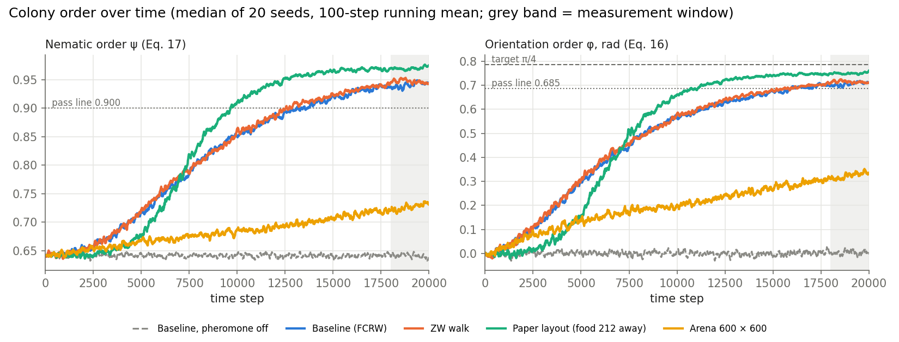
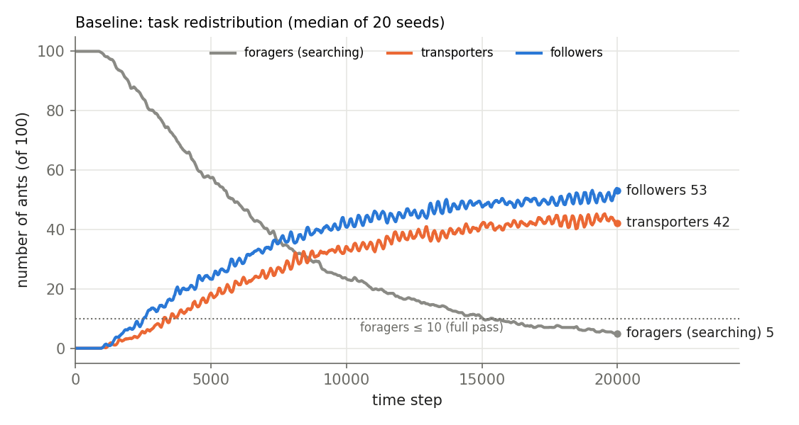
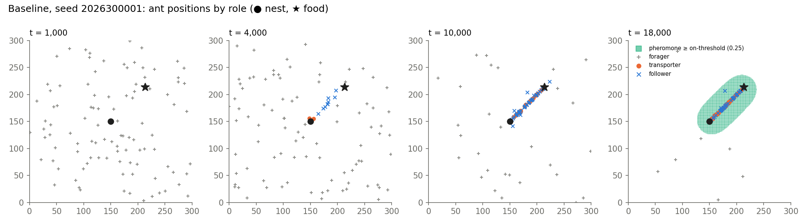
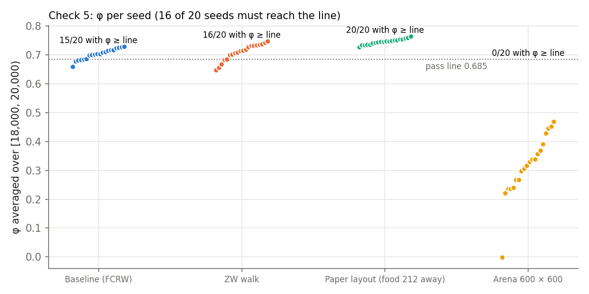
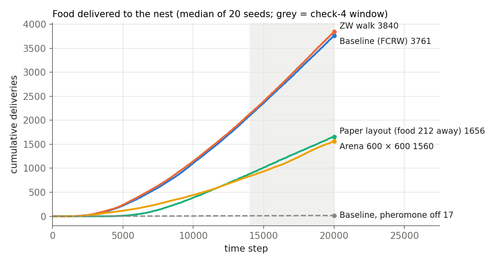
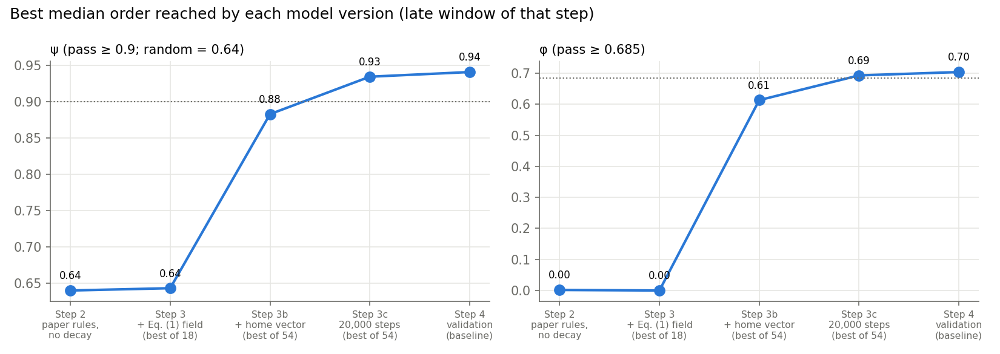

# Paper baseline: Zhang & Yong (2023) rules + Eq. (1) pheromone, five static checks

2026-10-03. Branch `paper-baseline`. Plan and both amendments: `docs/PAPER_BASELINE_PLAN.md`
(Sec. 7 = Amendment A, Sec. 8 = Amendment B; each written and committed before the runs it governs).
Code: `src/paper_baseline/`, `tests/test_paper_baseline.py`; runner `scripts/paper_baseline_run.py`,
checks/selection `scripts/paper_baseline_summarise.py`, figures `scripts/paper_baseline_figures.py`.

## Result in one paragraph

The paper's own rules (stride-3 coarse-grained return, with or without decay) **did not organise**
the colony (ψ = 0.64 = random headings). After two user decisions, each taken after a failed step
and recorded before the next run, transporters home by **path integration** (compass noise 0.1) and
runs last **20,000 steps**. The resulting baseline (FCRW, half-life 2000, D = 0.01, thresholds
0.25/0.125) **passes checks 1–4 in 20/20 validation seeds and reaches the full check-5 level in
its medians** (ψ 0.940, φ 0.704, 5.9 foragers), but check 5 is met by only **14 of 20 seeds (16
required)**, so **check 5 is formally not passed** (basic tier: 15/20). Pheromone-off controls fail
checks 2, 3 and 5, so the order comes from the pheromone. The ZW comparison arm passes all five
(full); the paper-layout arm passes check 5 in 20/20 seeds but fails check 1 (food twice as far);
the 600 × 600 arena fails check 5 clearly, so **the result depends on arena size**.

## Model (what differs from the paper)

| Rule | Paper (Zhang & Yong 2023) | This baseline |
|---|---|---|
| Search walk | FCRW γ 0.1, Θ 50°, step 0.6 | same |
| Boundary | reflective, 300 × 300 | same |
| Transporter return | retrace every 3rd vertex of own path | **path-integration home vector**, compass noise SD 0.1 rad/step, no landmarks; spiral search (no deposit) if the estimate says "home" but the nest (radius 3) is not seen (Amendment A) |
| After delivery | T → follower | same (heading turned 180°) |
| Follower | follows trail to food → transporter | same, bilateral scalar sensing; **our addition:** reverts to forager after 2 steps below the off-threshold |
| Pheromone | deposit, no decay, no diffusion | proposal Eq. (1): decay (half-life 2000) + diffusion D = 0.01, explicit FD, P = 0 at the edge |
| Geometry | nest ≈ (90, 90), food ≈ (240, 240), distance ≈ 212 (from Fig. 4) | nest (150, 150), food at distance 90 on the 45° axis; a paper-layout arm gives the direct comparison |

All new rules are options; with every option off the class reproduces the validated `Simulation`
exactly (test). 492 tests pass.

## How we got here (every step, including failures)

| Step | Model | Seeds × cells | Best median ψ / φ | Outcome |
|---|---|---|---|---|
| 2 paper-faithful | stride-3 return, no decay, D = 0 | 10 × 1 | 0.640 / 0.00 | no order; 6 deliveries in [6k, 12k) |
| 3 calibration | stride-3 + Eq. (1), 18 cells | 10 × 18 | 0.643 / 0.00 | **no cell passes**; stop |
| 3b calibration | **home vector** (Amendment A), σ {0, 0.1, 0.3} × 18 | 10 × 54 | 0.883 / 0.62 | checks 1–4 pass in ~30 cells; **check 5 fails in all** (φ); stop |
| 3c calibration | as 3b, **20,000 steps** (Amendment B) | 10 × 54 | 0.934 / 0.69 | no cell at basic pass (best: 7/10 seeds, 8 needed) → **fallback rule** |
| 4 validation | chosen cell + controls/arms | 20 × 8 | 0.940 / 0.70 | see below |

**Why Step 2–3 failed (seed 2026280001).** The stride-3 memory removes only small zigzags; the
return was ~95% as long as the outbound search (e.g. 823 steps vs 149 for a straight line).
Within 12,000 steps each ant made only a few trips, so repeated coarse-graining never straightened
the route, and the meandering returns laid pheromone over the arena (slow decay: 67% of the arena
above the on-threshold) or too faintly (fast decay: < 1%).

**Amendment A (after Step 3).** Path-integration homing. Reasons: the paper (p. 6) says ants
memorise the nest location using landmarks and path integration; its argument that repeated
coarse-graining ends in a straight nest–food path is the state a home vector reaches directly; the
supervisor's sketch, his teaching MATLAB model (straight return) and his request to study
egocentric vs geocentric navigation.

**Amendment B (after Step 3b).** 20,000-step runs, all late windows moved by +8,000 (trail share at
t = 18,000; deliveries in [14,000, 20,000); ψ, φ, roles over [18,000, 20,000); recruitment
[4,000, 20,000); discovery limit 4,000 unchanged); thresholds unchanged. Reasons: paper Fig. 4
runs to 20,000 steps, and in Step 3b the colony was still organising at 12,000 (best cell:
foragers 54 → 37 → 24 → 18 and φ 0.33 → 0.46 → 0.57 → 0.62 over successive 2,000-step blocks).
Fallback fixed in advance: if no cell reaches basic pass, take the cell with the most deliveries
among those passing checks 1–4 and report check 5 as not passed.

**Selection (Step 3c).** No cell reached basic pass; the fallback chose σ = 0.1, half-life 2000,
D = 0.01, thresholds 0.25/0.125 (1,683 median deliveries; ψ 0.934, φ 0.693, foragers 6.5; check 5
met by 7/10 seeds). **The tie-break list did not cover compass noise: σ = 0 and σ = 0.1 (same
pheromone settings, 1,664 vs 1,683 deliveries, within 5%) were separated by the last tie-break,
most deliveries, so σ = 0.1 was chosen.**

## Validation (Step 4): five-check table

20 fresh seeds (2026300001–020), 20,000 steps. A check passes if the median meets it **and** ≥ 16/20
seeds meet it. Numbers are medians; "n/20" = seeds meeting the check.

| Arm | 1 first pickup ≤ 4,000 | 2 recruited share ≥ 0.5 | 3 trail share ≥ 0.5 | 4 deliveries ≥ 100, R² ≥ 0.95 | 5 ψ / φ / foragers | Check 5 seeds (full / basic) | Tier |
|---|---|---|---|---|---|---|---|
| **Baseline (FCRW)** | 894 ✓ 20/20 | 1.00 ✓ 20/20 | 0.63 ✓ 20/20 | 1,684, 1.00 ✓ 20/20 | 0.940 / 0.704 / 5.9 | **14 / 15 ✗** | none (check 5 not passed) |
| Baseline, pheromone off | 894 ✓ | 0.00 ✗ | 0.00 ✗ | 5 ✗ | 0.641 / 0.002 / 99.9 | 0 / 0 | fails 2, 3, 5 as required |
| ZW walk | 948 ✓ 18/20 | 1.00 ✓ | 0.63 ✓ | 1,717, 1.00 ✓ | 0.948 / 0.715 / 4.5 | 16 / 16 ✓ | **full** |
| ZW, pheromone off | 948 ✓ | 0.00 ✗ | 0.00 ✗ | 6 ✗ | 0.640 / 0.002 / 99.8 | 0 / 0 | — |
| Arena 600 × 600 | 894 ✓ 18/20 | 1.00 ✓ | 0.64 ✓ | 716, 1.00 ✓ 19/20 | 0.726 / 0.324 / 55.4 | 0 / 0 ✗ | none |
| Arena 600, pheromone off | 894 ✓ | 0.00 ✗ | 0.00 ✗ | 2 ✗ | 0.640 / −0.001 / 100 | 0 / 0 | — |
| Paper layout (food 212 away) | 3,167 ✗ 13/20 | 1.00 ✓ | 0.63 ✓ | 768, 1.00 ✓ | 0.969 / 0.747 / 2.1 | 20 / 20 ✓ | none (check 1) |
| Paper layout, pheromone off | 3,167 ✗ | 0.00 ✗ | 0.00 ✗ | 5 ✗ | 0.641 / 0.005 / 99.7 | 0 / 0 | — |

Baseline seeds missing full check 5: 2026300007 (φ 0.678), …009 (φ 0.684), …011 (φ 0.659, 12.2
foragers), …012 (φ 0.684), …013 (φ 0.682), …020 (φ 0.687 but 10.3 foragers). All have ψ ≥ 0.91 and
pass checks 1–4; five of six miss on φ by ≤ 0.026.

## Figures


**Fig. 1.** ψ and φ rise from the random level (0.64, 0) to near the pass lines by 18,000–20,000 steps
in every arm except the 600 × 600 arena, while the pheromone-off control stays random throughout.


**Fig. 2.** In the baseline the colony shifts from 100 searching foragers to ~52 followers and ~42
transporters, with foragers falling below 10 only after ~15,000 steps.


**Fig. 3.** One baseline seed: ants are scattered at t = 1,000, a trail is forming at 4,000, and by
10,000–18,000 nearly all ants move on the straight nest–food line (green = cells above the
on-threshold at 18,000; diffusion makes the detectable band ~50 units wide).


**Fig. 4.** Per-seed φ in the measurement window: the baseline misses the 0.685 line in 5 of 20 seeds
(with one more seed failing on forager count, 14/20 meet check 5), ZW in 4, the paper layout in none.


**Fig. 5.** Deliveries grow linearly once the trail is established (R² ≈ 1 in [14,000, 20,000)); the
longer paper-layout trail and the large arena deliver fewer than half as much, and pheromone-off
delivers almost nothing.


**Fig. 6.** The best median order reached by each model version: neither the paper's coarse-grained
return nor adding decay/diffusion moved ψ off 0.64; the home vector did, and 20,000 steps brought
the medians to the pass lines.

## Comparison with paper Fig. 4 (paper-layout arm)

Medians, paper layout: ψ 0.646 / φ 0.04 at t = 4,000; ψ 0.907 / φ 0.654 at t = 10,000; ψ 0.969 /
φ 0.747 over [18,000, 20,000). The paper's FCRW curves reach ψ ≈ 0.95–1 and φ ≈ π/4 by about
10,000 steps. Our colony shows the same disorder → order transition but later and slightly short of
the paper's end values. First discovery in this arm: median 3,167 steps (13/20 seeds ≤ 4,000), so
check 1 fails here only because the 4,000-step limit was set for food at distance 90.

## Points to note

1. **Check 5 not passed by the chosen baseline** (14/20 seeds full, 15/20 basic, 16 needed), the
   same verdict as in calibration (7/10). Its medians meet the full level.
2. **Design flaw in the basic tier (our standard).** φ is the mean folded heading of all 100 ants and
   searching foragers pull it toward 0, so |φ − π/4| ≤ 0.1 needs roughly ≥ 87% of ants on the
   trail, which contradicts the basic tier's "foragers ≤ 25". Thresholds were not changed.
3. **ZW passes, FCRW does not, by a small margin** (16 vs 14 seeds). The baseline stays FCRW as planned
   (user decision after Step 4); switching after seeing results would be post hoc. This agrees with
   the paper's finding that ZW forages more efficiently, but the difference here is small.
4. **Arena-size dependence.** At 600 × 600 the colony is still organising at 20,000 steps (55
   foragers, ψ 0.73); one seed (2026300001) found food only at 5,604 steps and never organised
   (φ ≈ 0). The baseline's order depends on walls keeping searchers near the nest.
5. **Our additions to the paper**, stated as such: Eq. (1) decay and diffusion, path-integration homing
   with compass noise and spiral search, follower → forager reversion, bilateral scalar sensing.
6. **Earlier results** (Stage 5, H1a, H1b) were run on an earlier model and stay exploratory.

## Consequences for the next briefs

H1a/H1b reruns must relocate the food after the colony is organised, i.e. at 20,000 steps rather
than 12,000 (Amendment B). The H1a navigation question (path integration vs landmarks) now starts
from this baseline: σ = 0.1 home vector, no landmarks.

## Reproduce

```bash
python3 -m pytest -q
python3 scripts/paper_baseline_run.py paper && python3 scripts/paper_baseline_summarise.py paper
python3 scripts/paper_baseline_run.py calib && python3 scripts/paper_baseline_summarise.py calib
python3 scripts/paper_baseline_run.py calib2 && python3 scripts/paper_baseline_summarise.py calib2
python3 scripts/paper_baseline_run.py calib3 && python3 scripts/paper_baseline_summarise.py calib3
python3 scripts/paper_baseline_run.py valid && python3 scripts/paper_baseline_summarise.py valid
python3 scripts/paper_baseline_figures.py
```

Per-run JSON files (`results/paper_baseline/*/runs/`, ~230 MB) are not committed; the runner
regenerates them (≤ 4 workers, low priority; ~4 h in total on this Mac).
